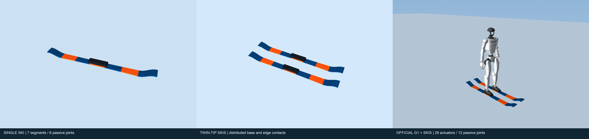
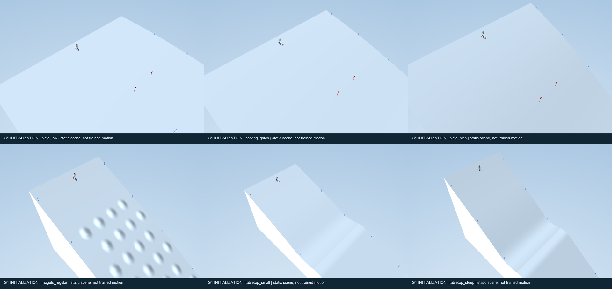
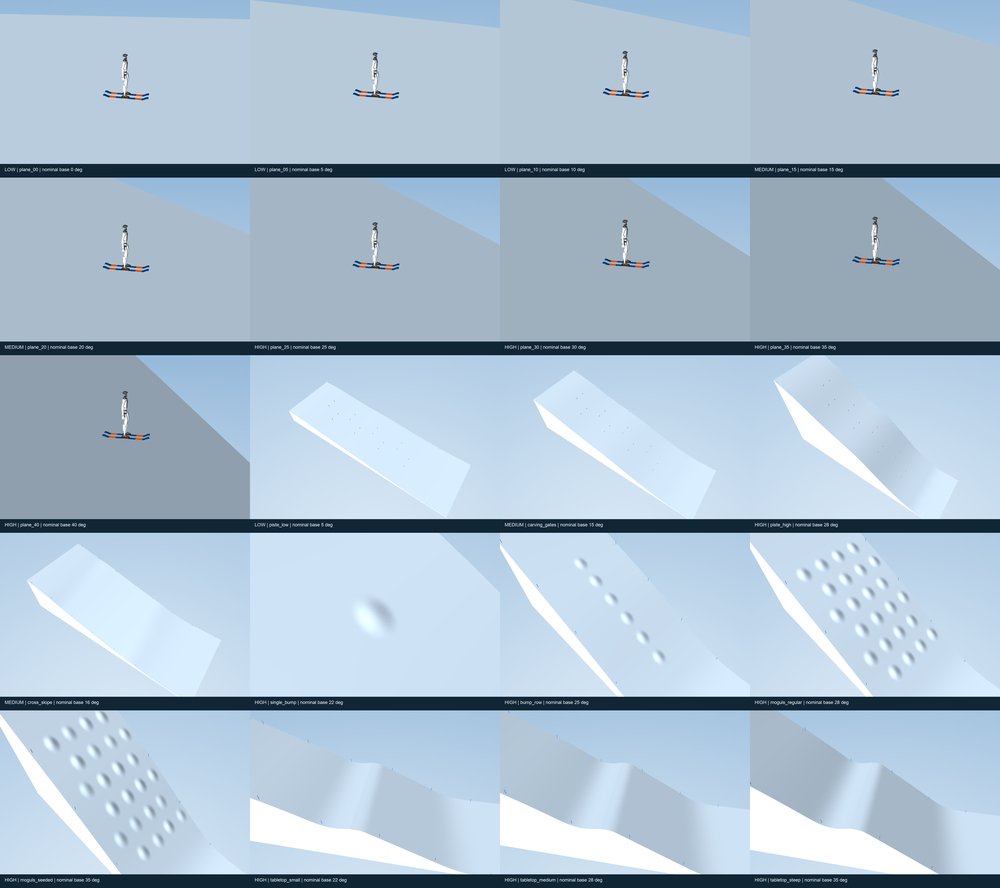

# 资产与训练环境渲染图

使用 MuJoCo 3.3.7 实际渲染，未更改几何、碰撞或物理参数。为避免高度场阴影条纹，仅在渲染时关闭阴影映射，保留地形法向明暗。

**机器人画面均为初始化静态场景，不是训练完成后的动作或成功轨迹。**

## 总览

## 单图索引

### 资产

- [SINGLE SKI | 7 segments / 6 passive joints](asset_ski_single.png)
- [TWIN-TIP SKIS | distributed base and edge contacts](asset_ski_pair.png)
- [OFFICIAL G1 + SKIS | 29 actuators / 12 passive joints](asset_g1_plane_00.png)

### 环境（低／中／高坡）

- [LOW | plane_00 | nominal base 0 deg](env_plane_00.png)
- [LOW | plane_05 | nominal base 5 deg](env_plane_05.png)
- [LOW | plane_10 | nominal base 10 deg](env_plane_10.png)
- [MEDIUM | plane_15 | nominal base 15 deg](env_plane_15.png)
- [MEDIUM | plane_20 | nominal base 20 deg](env_plane_20.png)
- [HIGH | plane_25 | nominal base 25 deg](env_plane_25.png)
- [HIGH | plane_30 | nominal base 30 deg](env_plane_30.png)
- [HIGH | plane_35 | nominal base 35 deg](env_plane_35.png)
- [HIGH | plane_40 | nominal base 40 deg](env_plane_40.png)
- [LOW | piste_low | nominal base 5 deg](env_piste_low.png)
- [MEDIUM | carving_gates | nominal base 15 deg](env_carving_gates.png)
- [HIGH | piste_high | nominal base 28 deg](env_piste_high.png)
- [MEDIUM | cross_slope | nominal base 16 deg](env_cross_slope.png)
- [HIGH | single_bump | nominal base 22 deg](env_single_bump.png)
- [HIGH | bump_row | nominal base 25 deg](env_bump_row.png)
- [HIGH | moguls_regular | nominal base 28 deg](env_moguls_regular.png)
- [HIGH | moguls_seeded | nominal base 35 deg](env_moguls_seeded.png)
- [HIGH | tabletop_small | nominal base 22 deg](env_tabletop_small.png)
- [HIGH | tabletop_medium | nominal base 28 deg](env_tabletop_medium.png)
- [HIGH | tabletop_steep | nominal base 35 deg](env_tabletop_steep.png)

### G1 训练场景初始化

- [G1 INITIALIZATION | piste_low | static scene, not trained motion](training_piste_low.png)
- [G1 INITIALIZATION | carving_gates | static scene, not trained motion](training_carving_gates.png)
- [G1 INITIALIZATION | piste_high | static scene, not trained motion](training_piste_high.png)
- [G1 INITIALIZATION | moguls_regular | static scene, not trained motion](training_moguls_regular.png)
- [G1 INITIALIZATION | tabletop_small | static scene, not trained motion](training_tabletop_small.png)
- [G1 INITIALIZATION | tabletop_steep | static scene, not trained motion](training_tabletop_steep.png)

复现：在项目根目录运行 `.venv/bin/python assets/env/tools/render_docs.py`。macOS 需要图形上下文权限。完整来源、镜头和状态说明见 `render_index.json`。
