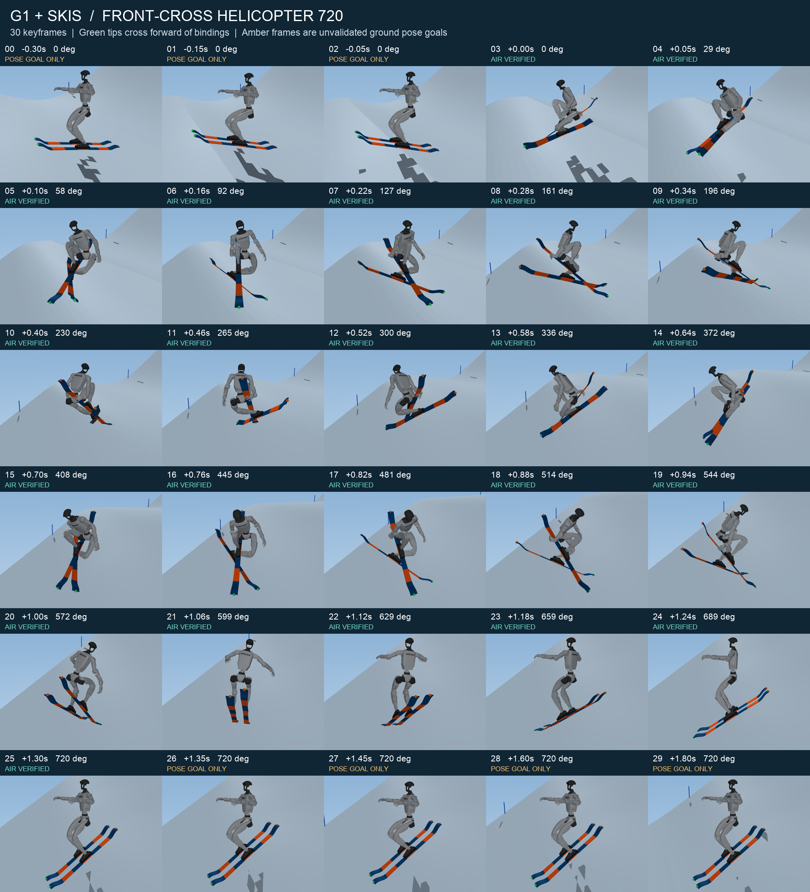

# G1 板头交叉 Helicopter 720 关键帧

已按 `reference.jpeg` 修正为**固定器前方交叉、被抓板尾抬起、落地前恢复平行**。共 30 个关键帧，使用真实 MuJoCo G1 与分段弹性雪板渲染。23 帧来自连续原生动力学空中轨迹；7 帧是起跳前／落地后的姿态目标。

**当前可用于空中课程的状态参考和姿态目标设计，不能作为已经完成真实起跳、抓牢雪板和稳定落地的成功示范。** 原生固定姿态落地试验失稳，失败轨迹与有效性标记均保留。没有根节点牵引、空中外加旋转力矩、隐形抓板 weld，也没有用图片生成替代 MuJoCo 渲染。



## 文件

| 文件 | 用途 |
|---|---|
| `frame_00.png` … `frame_29.png` | 每帧世界固定方位视图＋随身体朝向的俯视图；绿色点为板头，橙色点为板尾 |
| `overview.png` / `keyframes_preview.gif` | 30 帧总览／按关键帧顺序播放的示意动画，GIF 非等速物理回放 |
| `reference_comparison.png` | 用户原图与 G1 侧视、俯视对照 |
| `trajectory.png` | 高坡度跳台场景与实测质心抛物线 |
| `keyframes.json` | 帧时间、阶段、关节映射、姿态、速度、控制器记录、交叉指标与有效性标记 |
| `keyframes.npz` / `keyframes.csv` | 数值读取；CSV 的 29 个关节列均为弧度 |
| `keyframes_scene.xml` | 可加载的 MJCF，包含 30 个原生 keyframe，引用本仓库原始资产 |
| `placed_aerial.npz` | 200 Hz 采样的连续空中状态、连续转体角、速度与质心轨迹 |
| `validation.json` | 逐项自动检查和未通过的全流程能力说明 |
| `terrain_replay_validation.json` | 启用生产 SnowStepper 的连续原生回放检查 |
| `aerial_dt_convergence.json` | 0.125 ms 时间步复核 |
| `landing_probe.npz` / `.json` / `landing_failure.png` | 实际失败落地试验；禁止当作成功示范 |

## 动作和物理量

场景为 `g1_tabletop_steep.xml`，基础助滑坡度 35°，台唇上扬 18°。适配 G1 后采用约 **37.3° 的板头交叉投影角**，不强行要求 90°。交点沿左、右雪板局部 +X 分别位于固定器中心前方约 **19.0–19.1 cm、20.9–21.0 cm**，超过固定器前缘约 12 cm；不是板尾交叉。交点处板中心线存在约 7.4 cm 的上下间隔，避免两块有厚度的雪板互穿。

右手掌目标位于右板固定器后方约 35 cm，配合抬起板尾、收膝；空中保持段掌—板尾目标误差最大 **3.95 mm**。官方 G1 的手指是固定几何，因此这只是掌部接近／触板参考，不是已验证的闭合抓握。

显式空中课程初态：质心速度 **[6.70735, 0, 2.17935] m/s**，合速度 **7.05253 m/s**，方向与 18° 台唇一致；世界竖直角动量 **11.04607 kg·m²/s**，初始躯干滚转约 10.9°、俯仰约 −1.48°。这组速度高于此前场地 4／5／6 m/s 的离散测试点，已单独做本例空中几何和动力学回放验证，未扩大原有落地包络的认证。

空中时间 **1.30 s**，实际躯干连续航向 **719.911°**。保持交叉到 0.78 s，随后展开；1.18 s 的选定关键帧已经近似平行，验证区间 1.20–1.30 s 的投影夹角均小于 2°。不要用末帧四元数是否等于初帧来判断 720°，应读取连续展开的 `spin_unwrapped_deg`。

0.25 ms 仿真下，质心抛物线最大误差 **2.73 mm**，角动量漂移约 **0.163%**，原生自碰撞最大穿透约 **0.495 mm**，无 MuJoCo 警告。时间步减半到 0.125 ms 后末端航向差 **0.0437°**。启用生产雪面接触后，空中法向雪力为 **0 N**，状态与放置后的空中轨迹差约 **1.5×10⁻¹³**。

`actual_peak_torques` 使用限幅后的 **`qfrc_actuator`**，不能用限幅前的 `actuator_force` 冒充实际关节力矩。右肩 roll 在展开时达到官方 **25 Nm** 限幅；请求峰值约 127.75 Nm，最大主动关节跟踪误差约 0.191 rad。轨迹保留这个真实饱和效果，未提高电机能力。

## 训练接口与限制

- `time_s=0` 是已经交叉的**空中初始化状态**，不是从地面助滑自然生成的起跳事件。起跳前 3 帧与此初态之间没有验证过的动态过渡；不要直接插值拼成成功示范。
- `masks.dynamic_state=true`／NPZ `dynamic_valid=true` 仅适用于 0–1.30 s 的 23 帧，可用于空中姿态和速度参考。触雪边界帧尚未经历接触冲量，不能解释为落地成功。
- 7 个地面帧仅为姿态目标，已检查关节范围、自碰撞和雪板—雪面几何；`dynamic_state=false`、`velocity_reference=false`。其零速度数组是无效占位，不应进入速度损失。几何合法不代表接触平衡或过渡动态可达。
- `ctrl` 是 4 kHz 原生位置执行器＋逆动力学前馈教师的记录，连续文件采样率为 200 Hz；**不是已经验证的 100 Hz LLC 动作**。`action_reference`／`action_valid` 全部为 false。先使用状态跟踪目标，LLC 100 Hz 降采样与稳定性应独立验证。
- `physical_grasp_valid` 和 `full_skill_valid` 全为 false。原生固定姿态落地后 0.5 s 失稳，躯干竖直分量最低约 0.221，最深接触约 25.1 mm；失败诊断与目标姿态不可混用。
- `qpos` 遵循 MuJoCo 顺序，根姿态四元数为 **wxyz**；主动关节索引请读取 JSON 的 joint addresses，不要将 12 个被动雪板弹性关节误当控制量。
- MJCF 内 keyframe 的时间统一加了 0.30 s；JSON／NPZ 保留以空中初态为零的相对时间。加载 keyframe 可用于可视化或课程 reset，不能在评测每步覆盖 `qpos`。
- 接地训练与回放必须使用 `assets/env/tools/runtime.py` 的 `SnowStepper`，不能直接用 XML 的原始 `mj_step` 代替方向性雪面接触。

这些标记对应训练策略文档的显式初态课程许可，以及 S11–S13 对落地包络和真实起跳全链路的分别验收要求。本交付没有宣称完成全链路 S13。

```python
from pathlib import Path
import numpy as np
base = Path('/Users/mgccvmacair/Myproject/showcase/mujoco/ski/docs/imgs/keyframe')
a = np.load(base / 'keyframes.npz', allow_pickle=False)
mask = a['dynamic_valid']
reference_times = a['time'][mask]
reference_qpos = a['qpos'][mask]
reference_qvel = a['qvel'][mask]
# 为参考跟踪构造观测／奖励；不要逐步写入仿真 qpos。
# 四元数插值用 SLERP，转体进度使用 spin_unwrapped_deg。
```

## 复现

在项目根目录依次运行。绘图需要 macOS 图形会话；其他检查不依赖 Blender。

```bash
.venv/bin/python assets/env/tools/cross_720.py
.venv/bin/python assets/env/tools/shoot_cross_720.py
.venv/bin/python assets/env/tools/verify_720_dt.py
.venv/bin/python assets/env/tools/place_720.py
.venv/bin/python assets/env/tools/verify_720_terrain.py
.venv/bin/python assets/env/tools/export_720.py
.venv/bin/python assets/env/tools/render_720.py
```

## 人类参考来源

主要姿态依据是用户提供的 `reference.jpeg`：板头交叉、收膝、抓抬起的板尾。附加真实运动员图片保存在 `references/`，来源及哈希见 `references/sources.json`：[Noah Morrison 影片文章](https://forecastski.com/blogs/video/noah-morrison-through-sun-and-clouds)、[Irving 兄妹赛事文章](https://www.skyhinews.com/news/irving-siblings-of-winter-park-get-ready-for-aspen-x-games/)。单张照片只作为形态参考，不证明照片中完成了 720°，也不用于推断未知人物身份。

动作命名参考 [FIS Freestyle Skiing Judging Handbook](https://assets.fis-ski.com/f/252177/x/40158d23e4/freestyle-skiing-judging-handbook.pdf)。本数据是人工目标＋仿真生成轨迹，不是专业运动员的三维动作捕捉数据；参考照片版权属于原权利人。
